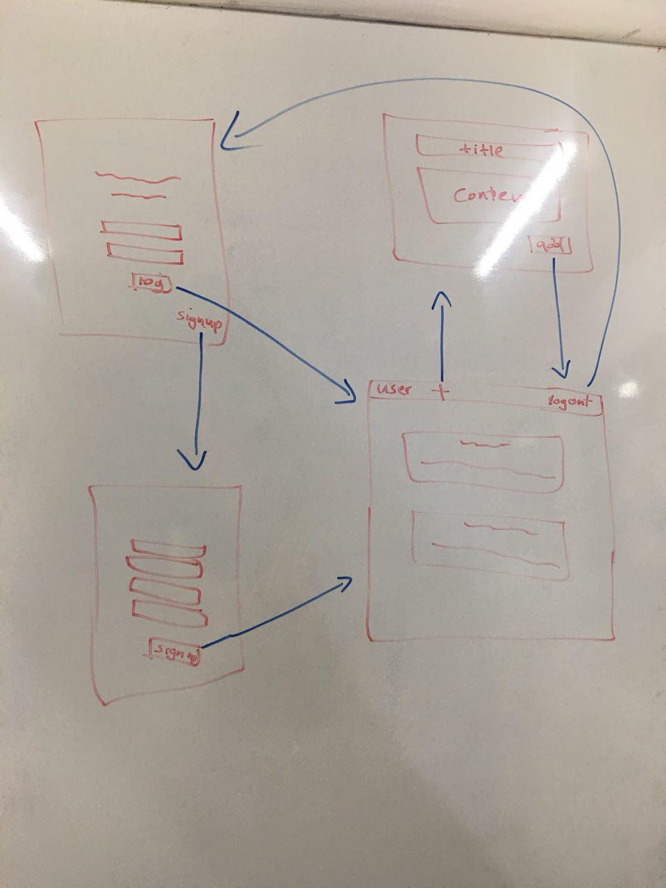
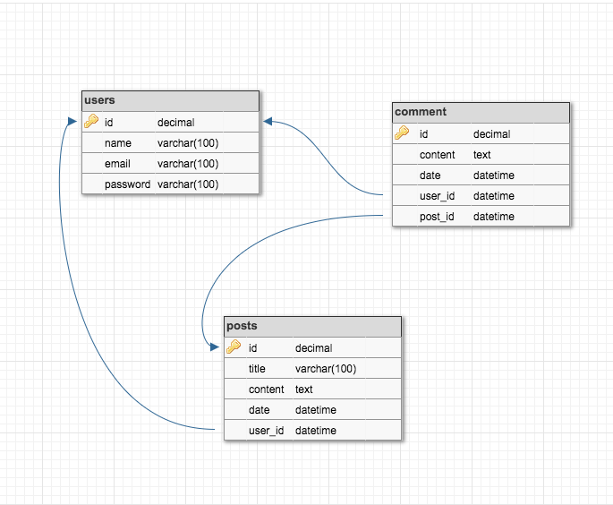

# Blog
week 7 database project for blog posts
# Abstract idea:
Make an APP for add blog post

### User story
* >As a user I want to be able to login
* >As a user I want to be able to logout
* >As a user I want to be able to signup
* >As a user I want to be able to read all users posts
* >As a user I want to be able to create new post
* >As a user I want to be able to see my name in all pages


### Requirements
+ [ ] Login form with 2 fields - username and password
+ [ ] Client-side _and_ server-side validation on login form, including error handling that provides feedback to users
+ [ ] Users only have to log in once (i.e. implement a cookie-based session on login)
+ [ ] Username is visible on each page of the site after logging in
+ [ ] Any user-submitted content should be labelled with the authors username
+ [ ] There should be protected routes and unprotected routes that depend on the user having a cookie or not (or what level of access they have).
+ [ ] Website content should be stored in a database

### System Structure



### SCHEMA Diagram


### How to use:
1. **Developer side:**
 * ```clone git@github.com:FACG2/Blog.git```
 * ```npm i```
 * ```npm run watch```


2. **User side:**
 * Login to the website
 * look to the all posts
 * create new post by click on the button in the top of the page
 * If you don't have account you can signup


## Team :sunglasses: :
* [Aia](http://github.com/)
* [Salwa](http://github.com/)
* [Samir](http://github.com/)
* [Mahmoud](http://github.com/mrm7moud)
